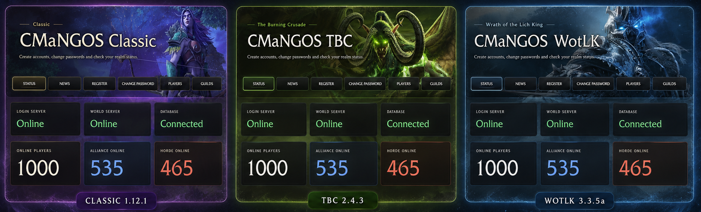
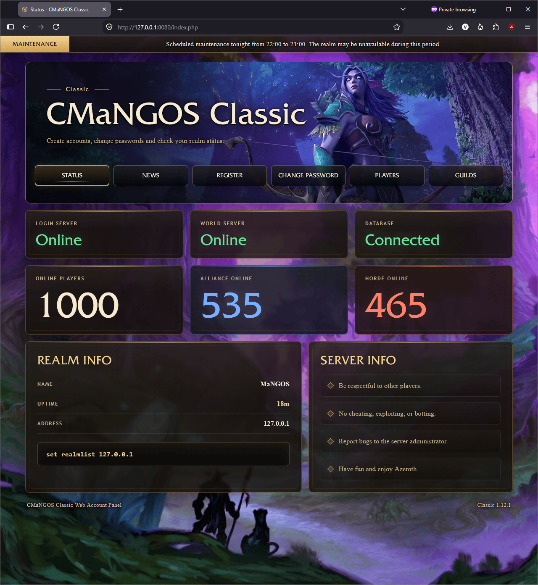
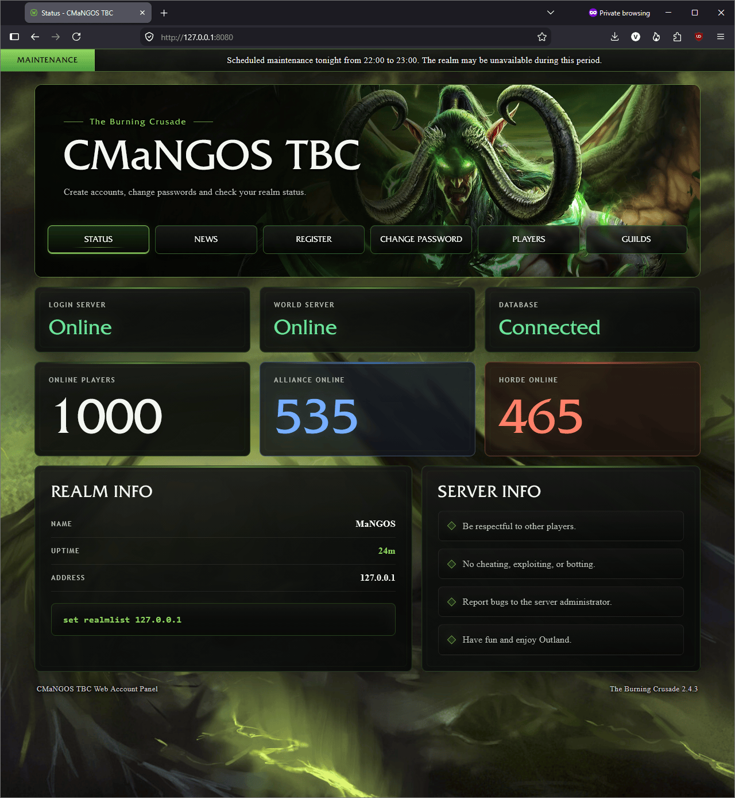
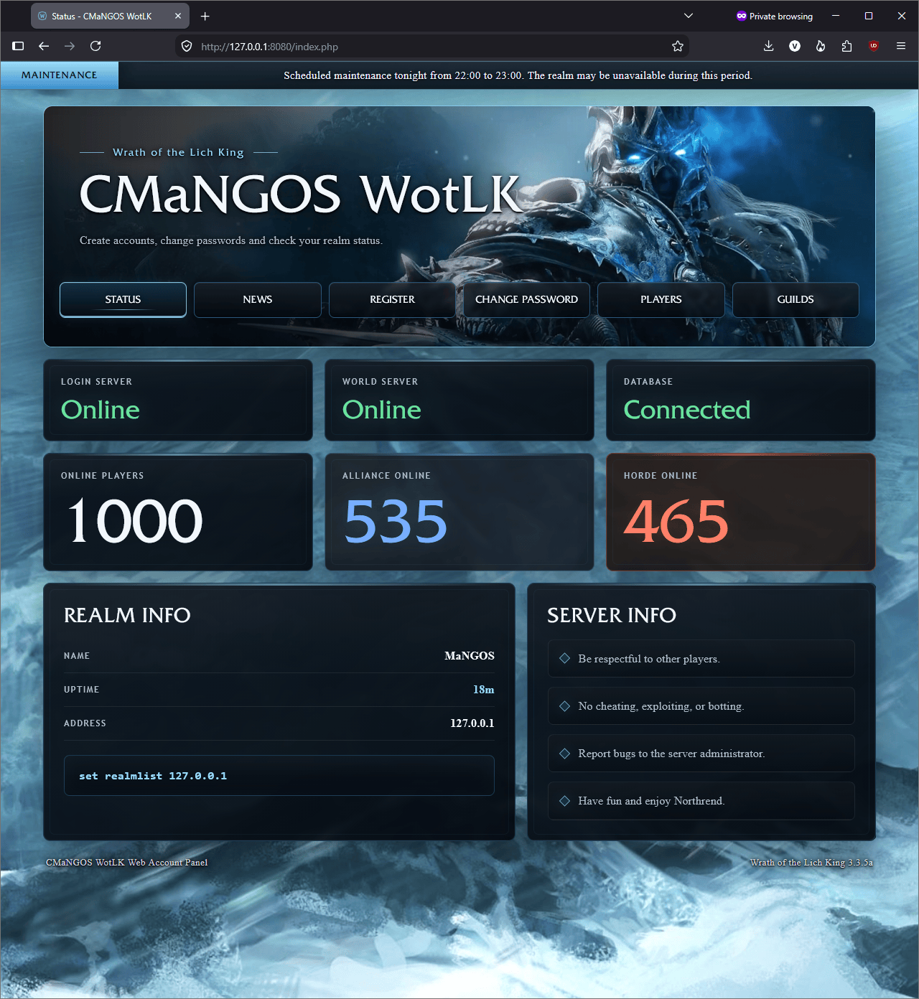

# CMaNGOS Web Account Panels

Portable local web account panels for **CMaNGOS Classic, The Burning Crusade and Wrath of the Lich King**.

## Download

Download the version matching your CMaNGOS server:

- **CMaNGOS Classic 1.12.1** — [Direct download](https://github.com/patrikv13/cmangos-web-account-panel/releases/download/v27/CMaNGOS-Classic_website_v27.zip)
- **CMaNGOS TBC 2.4.3** — [Direct download](https://github.com/patrikv13/cmangos-web-account-panel/releases/download/v27/CMaNGOS-TBC_website_v27.zip)
- **CMaNGOS WotLK 3.3.5a** — [Direct download](https://github.com/patrikv13/cmangos-web-account-panel/releases/download/v27/CMaNGOS-WotLK_website_v27.zip)

You can also view the complete release page:

[View the latest release](https://github.com/patrikv13/cmangos-web-account-panel/releases/latest)

## Features

- Account registration
- Password changes using CMaNGOS SRP6
- Login server, world server and database status
- Realm information and uptime
- Online player counts by faction
- Character search
- Guild rankings and guild search
- Editable realm news
- Optional maintenance notice
- Responsive layout
- Animated hero video with static fallback
- Portable PHP runtime included

## Classic 1.12.1

## The Burning Crusade 2.4.3

## Wrath of the Lich King 3.3.5a

## Installation

1. Download the archive matching your CMaNGOS version.
2. Extract the included `web` folder into your CMaNGOS server folder.
3. Start the CMaNGOS MySQL server.
4. Run `Setup Website DB User.bat` and enter the requested MySQL host, port, administrator username and password.
5. Run `Start Website - PHP Builtin.bat`.
6. Open `http://127.0.0.1:8080` in your browser.

Detailed setup, configuration and troubleshooting instructions are included in each archive.

## Requirements

- 64-bit Windows
- Microsoft Visual C++ Redistributable 2015–2022 x64
- Windows PowerShell
- A working CMaNGOS server installation
- CMaNGOS MySQL databases for the selected expansion

A portable 64-bit PHP runtime with GMP and PDO MySQL is included in each package.

## Local Use and Security

This project is designed for local use on `127.0.0.1`.

Do not expose PHP's built-in server or MySQL directly to the public internet. A public deployment requires a production web server, HTTPS, CSRF protection, rate limiting, CAPTCHA, security headers and restricted file permissions.

## Customization

The included README explains how to customize:

- Visible text and labels
- Realm news
- Maintenance notices
- Background images
- Hero video
- Theme styling

## Disclaimer

This is an independent community project for CMaNGOS. It is not affiliated with or endorsed by Blizzard Entertainment.
